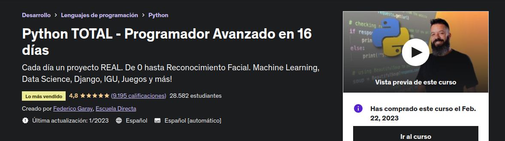
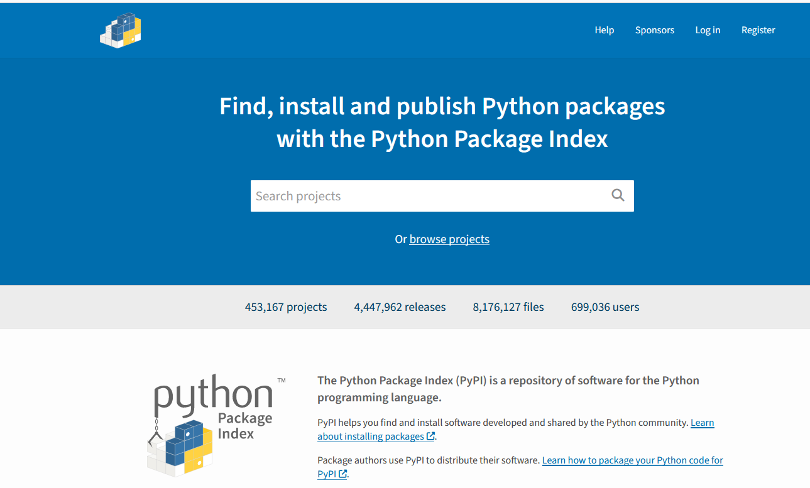
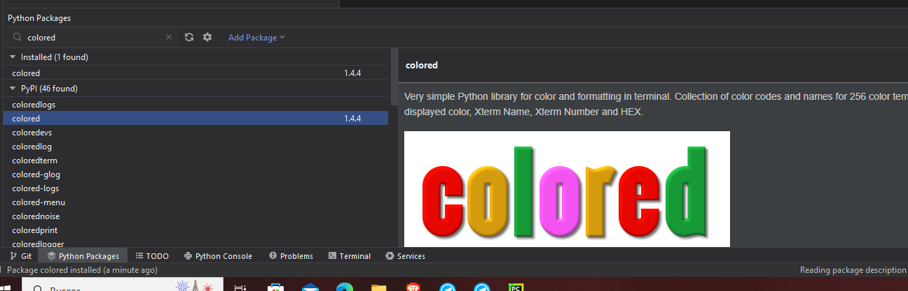
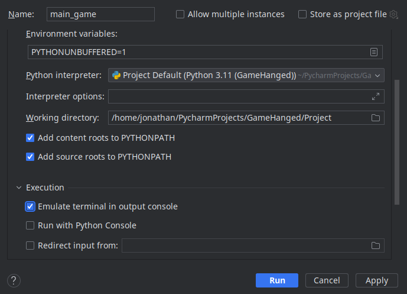

# Curso de Udemy





### Resumen de contenidos

- Desde el día 1 al día 6: **Entrenamiento básico.** Los conceptos fundamentales de Python para ser un programador robusto y con la base bien firme


- Desde el día 7 al día 9: **Fase avanzada.** Ingresa a la Programación Orientada a Objetos (OOP), para crear programas ágiles, sólidos, económicos, repetibles, y fáciles de mantener.


- Desde el día 10 en adelante: **Evoluciona a Experto.** Ya eres un programador avanzado de python, y ha llegado la hora de conocer sus principales aplicaciones en el mundo real. 
    
### Enlace
  https://www.udemy.com/course/python-total/

### Estadísticas

    Código: Python
    IDE: Pycharm (Linux)
    Idiomas: Español
    Subtítulos: Sí
    Clases: 244
    Vídeo: 30,5 horas en total
    Instructor: Federico Garay


## Sección 8: Programa una consola de turnos

### Ejercicios
| Modules  | Exceptions | Decorators |
|----------|------------|------------|
| Packages | Tests      | Generators |

### Instalación de paquetes
https://pypi.org/

#### Utilizados
- PyLint (Analizador de código)
```
pylint <file> -r y
```






### Problemas
- Cuando se descarga el repositorio no se detecta el intérprete de Python.


- No funcionan los comandos de limpiar consola «debug config»



### Proyecto

- Ejecución desde la salida de la consola


### Instrucciones

- Instar última versíón de Python
- Instalar Pycharm IDE Community
-  Vincular cuenta de GitHub


